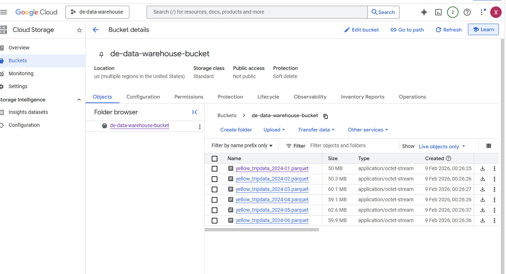

# 03 - Data Warehouse 🗄️

## Quick start

This folder contains `load_yellow_taxi_data.py`, a small script that downloads 2024 Yellow Taxi Parquet files and uploads them to a Google Cloud Storage (GCS) bucket.

### Credentials 

Set the `GOOGLE_APPLICATION_CREDENTIALS` environment variable to the path of service account JSON file. This avoids hardcoding credentials and lets Google client libraries use Application Default Credentials (ADC).

Example:

```bash
export GOOGLE_APPLICATION_CREDENTIALS="/full/path/to/service_account.json"
```

### Bucket access 

Make sure the `BUCKET_NAME` constant in `load_yellow_taxi_data.py` points to a bucket you own and which your credentials can access. 

### Usage

```bash
cd 03-data-warehouse
uv run python load_yellow_taxi_data.py
```

### Output




---

## Homework — Questions & Answers

### Question 1 — Counting records
What is count of records for the 2024 Yellow Taxi Data?

**Answer:** **20,332,093**

```sql
-- Creating external table referring to GCS path
CREATE OR REPLACE EXTERNAL TABLE `theta-carving-486822-c0.nytaxi.external_yellow_tripdata`
OPTIONS (
  format = 'parquet',
  uris = ['gs://de-data-warehouse-bucket/yellow_tripdata_2024-*.parquet']
);

-- Get records count
SELECT COUNT(VendorID)
FROM `theta-carving-486822-c0.nytaxi.external_yellow_tripdata`;
```

---

### Question 2 — Data read estimation
What is the estimated amount of data read when running the same query on the external table vs. a materialized table?

**Answer:** **0 MB** (External Table) and **155.12 MB** (Materialized Table)

```sql
-- Create a non-partitioned materialized table from the external table
CREATE OR REPLACE TABLE `theta-carving-486822-c0.nytaxi.yellow_tripdata_non_partitioned` AS
SELECT * FROM `theta-carving-486822-c0.nytaxi.external_yellow_tripdata`;

-- Compare distinct counts (example validation)
SELECT COUNT(DISTINCT PULocationID)
FROM `theta-carving-486822-c0.nytaxi.external_yellow_tripdata`;

SELECT COUNT(DISTINCT PULocationID)
FROM `theta-carving-486822-c0.nytaxi.yellow_tripdata_non_partitioned`;
```

---

### Question 3 — Understanding columnar storage
Why do queries selecting different numbers of columns estimate different read sizes?

**Answer:** BigQuery is columnar and scans only the columns referenced in the query. Selecting two columns (PULocationID, DOLocationID) requires reading more data than selecting one column, so the estimated bytes processed increases.

---

### Question 4 — Counting zero-fare trips
How many records have a fare_amount of 0?

**Answer:** **8,333**

```sql
SELECT COUNT(VendorID)
FROM `theta-carving-486822-c0.nytaxi.yellow_tripdata_non_partitioned`
WHERE fare_amount = 0;
```

---

### Question 5 — Partitioning and clustering
What's a good strategy if queries always filter on `tpep_dropoff_datetime` and order by `VendorID`?

**Answer:** Partition by `tpep_dropoff_datetime` (or DATE of tpep_pickup_datetime) and cluster by `VendorID`.

```sql
-- Partitioned and clustered table
CREATE OR REPLACE TABLE `theta-carving-486822-c0.nytaxi.yellow_tripdata_partitioned_clustered`
PARTITION BY DATE(tpep_pickup_datetime)
CLUSTER BY VendorID AS
SELECT * FROM `theta-carving-486822-c0.nytaxi.external_yellow_tripdata`;
```

---

### Question 6 — Partition benefits
Compare estimated bytes for a date-filtered query on the non-partitioned vs partitioned table.

**Answer:** **310.24 MB** (non-partitioned) and **26.84 MB** (partitioned)

```sql
SELECT COUNT(VendorID) AS VendorID_count
FROM `theta-carving-486822-c0.nytaxi.yellow_tripdata_non_partitioned`
WHERE DATE(tpep_pickup_datetime) BETWEEN '2024-03-01' AND '2024-03-15';

SELECT COUNT(VendorID) AS VendorID_count
FROM `theta-carving-486822-c0.nytaxi.yellow_tripdata_partitioned_clustered`
WHERE DATE(tpep_pickup_datetime) BETWEEN '2024-03-01' AND '2024-03-15';
```

---

### Question 7 — External table storage
Where is the data stored in the External Table you created?

**Answer:** **GCS bucket** (Google Cloud Storage).

---

### Question 8 — Clustering best practices
Is it best practice to always cluster your data in BigQuery?

**Answer:** **False** — clustering helps for certain query patterns but isn't universally best for all datasets.

---

### Question 9 — Understanding table scans
If you run `SELECT COUNT(*)` on a materialized/optimized table, how many bytes are estimated to be read and why?

**Answer:** **0 B** — BigQuery can use table metadata to answer row-count queries without scanning table blocks, so bytes processed are shown as 0.

---
